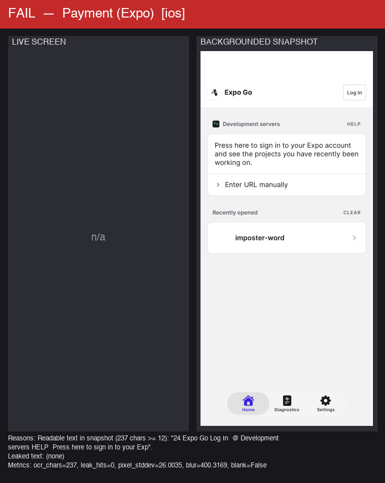
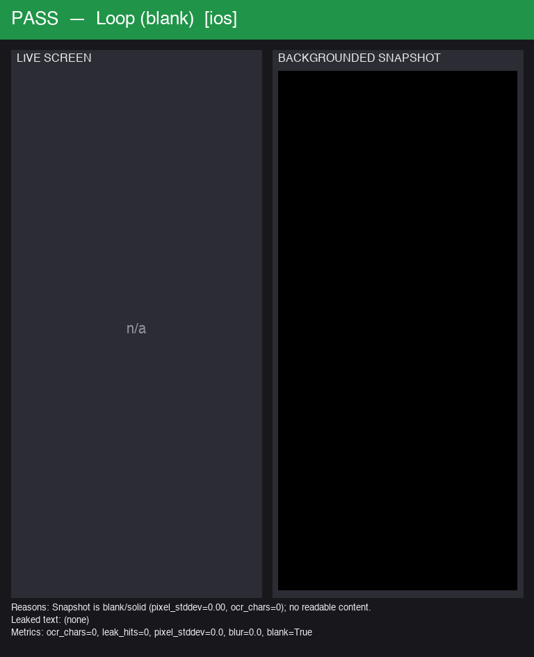

# Redaction Check Report

**Overall: FAIL**

> OWASP MASVS MSTG-STORAGE-9 / PCI — sensitive data must be removed from views when the app is backgrounded (app-switcher / recents snapshot).

Screens checked: 2 | FAIL: 1 | PASS: 1 | ERROR: 0

## FAIL — Payment (Expo) (ios)

- **Sensitive screen:** True
- **Verdict:** FAIL
- **Reasons:**
  - Readable text in snapshot (237 chars >= 12): "24 Expo Go Log In  @ Development servers HELP  Press here to sign in to your Exp".
- **Leaked text:** (none)
- **Metrics:** ocr_chars=237, leak_hits=0, pixel_stddev=26.0035, blur=400.3169, blank=False

## PASS — Loop (blank) (ios)

- **Sensitive screen:** True
- **Verdict:** PASS
- **Reasons:**
  - Snapshot is blank/solid (pixel_stddev=0.00, ocr_chars=0); no readable content.
- **Leaked text:** (none)
- **Metrics:** ocr_chars=0, leak_hits=0, pixel_stddev=0.0, blur=0.0, blank=True

